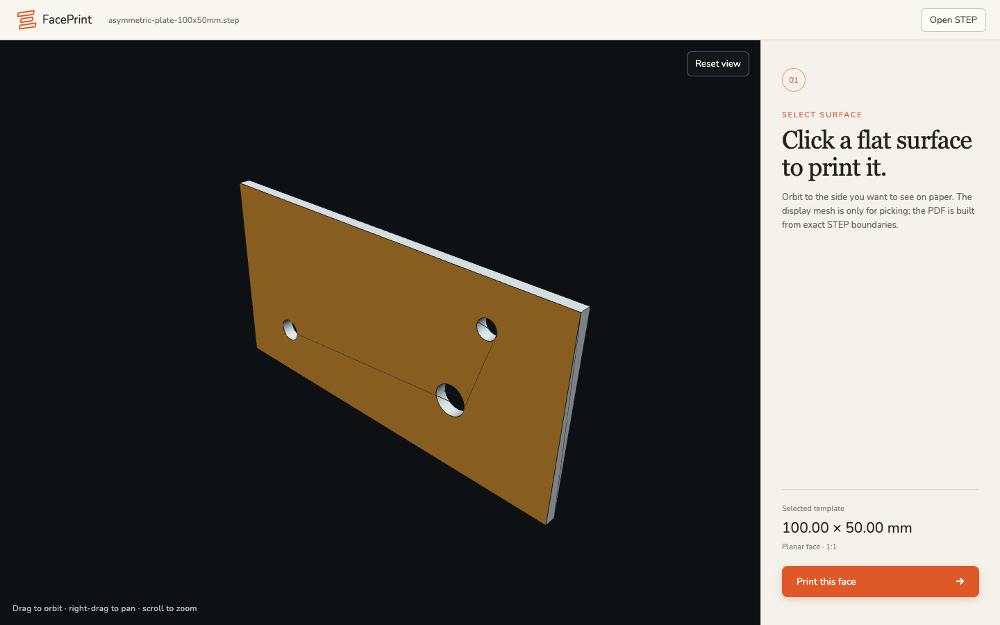
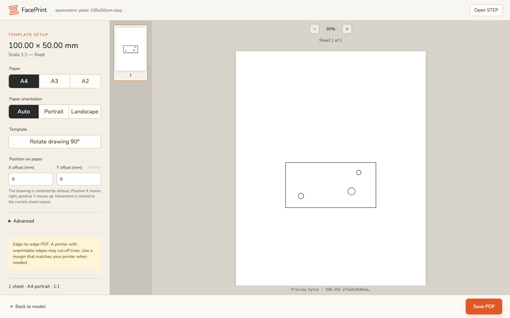

# FacePrint

FacePrint is an offline desktop app that turns a planar face from a STEP model
into a full-scale tiled PDF. Open or drop a `.step` or `.stp` file, select a
flat face, choose the paper size and orientation, preview the generated PDF,
and save it with the native file dialog.

The viewport mesh is used only for display and picking. Printable boundaries
come from OCCT B-Rep wires, are flattened in millimetres, written as vector PDF
paths, and tiled by `pdftilecut`.

## Features

- Imports STEP models locally; model data is not uploaded.
- Selects planar faces in an interactive 3D viewport.
- Generates vector PDF templates for A4, A3, or A2 paper.
- Supports portrait, landscape, margins, page overlap, and X/Y positioning.
- Previews the exact PDF bytes that will be saved.
- Builds native macOS arm64 and Windows amd64 applications.

FacePrint currently targets single-body planar-face workflows. STL, direct
printing, modeling, and general assembly support are outside the current scope.
See [implementation status](docs/implementation-status.md) for the tested
behavior and known limitations.

## How it works

### 1. Select a face

Open a STEP model and click the planar surface you want to turn into a
full-scale template.



### 2. Set up and preview the PDF

Choose the paper size, orientation, position, and margins, then inspect the
exact PDF output before saving it.



## Download CI builds

The [build workflow](.github/workflows/build.yml) runs for pushes, pull
requests, and manual dispatches. Open a completed run in the repository's
**Actions** tab and download one of these artifacts:

- `FacePrint-macos-arm64` contains `FacePrint.app` in a ZIP archive.
- `FacePrint-windows-amd64` contains `FacePrint.exe`, the FacePrint license,
  and third-party notices in a ZIP archive.

CI builds are not signed with trusted publisher identities. On macOS,
Gatekeeper may require an explicit approval before opening the ad-hoc-signed
app. On Windows, SmartScreen may warn about an unknown publisher. Distribution
signing and notarization should be added before a public release.

## Build from source

### Prerequisites

- Go 1.26.8
- Node.js 22 and npm
- Git
- The `pdftilecut` fork at commit
  `5f288f69661cbf13e5a4db859ca265b80498b8d0`, checked out next to this repo

Clone both repositories side by side:

```sh
git clone https://github.com/eliasrenman/Faceprint.git faceprint
git clone --recurse-submodules https://github.com/eliasrenman/pdftilecut.git
git -C pdftilecut checkout 5f288f69661cbf13e5a4db859ca265b80498b8d0
git -C pdftilecut submodule update --init --recursive
cd faceprint
```

The app's `go.work` file expects that sibling layout. If the tiler is elsewhere,
set `PDFTILECUT_DIR` to its checkout and either update `go.work` or build with an
equivalent workspace layout.

### macOS arm64

Install Xcode command-line tools, CMake, and Make, then run:

```sh
./scripts/package-macos.sh
```

The output is `build/bin/FacePrint.app`. The script builds static QPDF, zlib,
and libjpeg-turbo libraries, builds the app, includes license notices, applies
an ad-hoc signature, and runs the packaged WebView self-test.

### Windows amd64

Install MSYS2 and open a UCRT64 shell. Install the required packages:

```sh
pacman -S --needed git make mingw-w64-ucrt-x86_64-toolchain \
  mingw-w64-ucrt-x86_64-cmake mingw-w64-ucrt-x86_64-ninja
```

From that shell, run:

```sh
./scripts/package-windows.sh
```

The output is `build/bin/FacePrint-windows-amd64`. It contains the executable,
the project license, and third-party notices.

## Tests

After the native dependencies have been built by either packaging script:

```sh
cd frontend
npm ci
npm run check
npm test
cd ..
go test ./...
```

## Documentation

- [Architecture](docs/architecture.md)
- [Printing guidance](docs/printing.md)
- [Kernel replacement](docs/kernel-replacement.md)
- [Pinned dependency versions](docs/dependency-versions.md)
- [Implementation status](docs/implementation-status.md)

## License

FacePrint is available under the [MIT License](LICENSE). Third-party license
texts and attribution notices are collected in
[resources/licenses](resources/licenses/THIRD_PARTY_NOTICES.md).
